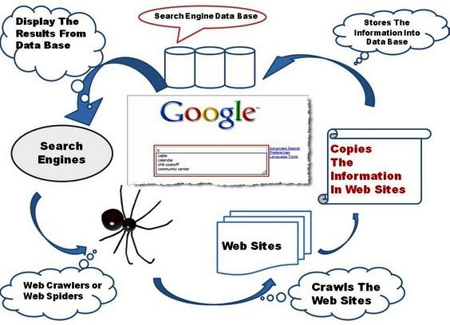

# Crawler 

## Web Crawler

adalah sebuah program dengan metode tertentu yang berfungsi untuk melakukan Scan atau crawl ke semua halaman internet untuk mencari data yang diinginkan. Data tersebut merupakan hasil teratas dari mesin pencari google dan yahoo. Web Crawler atau web spider, web robot, bot crawl dan automathic indeker. Web clawer memiliki beberapa maafaat dan tujuan tetapi penggunaan yang paling umum digunakan sebagai search engine. Search engine merupakan sebuah tool yang berfungsi sebagai mesin pencari seperti google.

Ilustrasi : 

[

## Berikut Code untuk melakukan Crawling :

```python
def crawl(src):
	global c
    page = requests.get(src)

    # Mengubah html ke object beautiful soup
    soup = BeautifulSoup(page.content, 'html.parser')

    # Find all item
    items = soup.findAll(class_='article-item')

    #print ('Proses : %.2f' %((c/maxPage)*100) + '%'); c+=1
    for item in items:
        judul = item.find(class_='title-article').getText()
        authors = item.find(class_="author-article").findAll(class_='title-author')
        author = ''
        for i in authors: author = author+i.getText()+'; '
        abstrack = item.find(class_='article-abstract').find('p').getText()

        #pengecekan data redundant
        cursor = conn.execute('select * from jurnal2 where judul=?', (judul,))
        cursor = cursor.fetchall()
        if (len(cursor) == 0):
            conn.execute("INSERT INTO jurnal2 \
                        VALUES (?, ?, ?, ?)", (judul, author, abstrack, kategori));
```

## Blockquotes

> **Perlu diingat bahwa, setiap web memiliki struktur html yang berbeda**, maka jika kalian mengubah url web, maka perlu dilakukan penyesuaian pada code. Selanjutnya, Untuk mendapatkan tag html .yang diinginkan BeautifulSoup menyediakan 2 fungsi, yaitu :
>
> 1. soup.find(parameter)
>
>    digunakan untuk mendapatkan *satu* tag html yang muncul pertama kali. Hasilnya berupa objek `soup`
>
> 2. soup.findAll(parameter)
>
>    digunakan untuk mendapatkan *semua* tag html tersebut. Hasilnya berupa `list`
>
>    

> **Sementara itu**, untuk parameternya memiliki 3 macam. Kalian bisa mencari berdasarkan:
>
> 1. tag html (seperti `<p>`, `<div>`, `h1` dsb).
>
>    contoh:
>
>    code html `<div><p>Saya Suka Coding</p></div>`
>
>    maka, untuk mendapatkan tag p adalah : `soup.find("p")`
>
> 2. class
>
>    code html `<div><p class='Suka'>Saya Suka Coding</p></div>`
>
>    maka, untuk mendapatkan tag p adalah : `soup.find(class_='Suka')`
>
> 3. id
>
>    code html `<div><p id='Coding'>Saya Suka Coding</p></div>`
>
>    maka, untuk mendapatkan tag p adalah : `soup.find(id='Coding')`

> > **Kemudian**, untuk mendapatkan textnya, digunakan `.getText()` pada objek BeautifulSoup.
> >
> > Setelah paham tentang bagaimana menggunakan library beautifulsoup, Selanjutnya akan membahas bagaimana code di atas bekerja.
> >
> > ```python
> > items = soup.findAll(class_='article-item')
> > ```

> Hal pertama yang kita lakukan adalah menentukan apa saja yang akan kita ambil. Pada kasus jurnal online ini, kita hanya akan mengambil judul, penulis, beserta abstraknya saja. Untuk itu, di sini kita mengambil semua paper, yang bisa kita lihat berada di class 'article-item'.
>
>   ``` python
>   for item in items:
>         judul = item.find(class_='title-article').getText()
>         authors = item.find(class_="author-article").findAll(class_='title-author')
>         author = ''
>         for i in authors: author = author+i.getText()+'; '
>         abstrack = item.find(class_='article-abstract').find('p').getText()
>   ```

  > Kemudian, untuk setiap paper, ambil judul (dengan class 'title-article'), penulis (dengan class 'author-article'), dan abstrak (dengan class 'article-abstract', lantas dicari tag p)

``` python
#pengecekan data redundant
        cursor = conn.execute('select * from jurnal2 where judul=?', (judul,))
        cursor = cursor.fetchall()
        if (len(cursor) == 0):
            conn.execute("INSERT INTO jurnal2 \
                        VALUES (?, ?, ?, ?)", (judul, author, abstrack, kategori));

```

Kemudian, memasukkan ke dalam database. Sebelum itu, perlu dilakukan pengecekan apakah ada data yang sama. Karena hal itu bisa mengganggu hasil akhir nanti.

